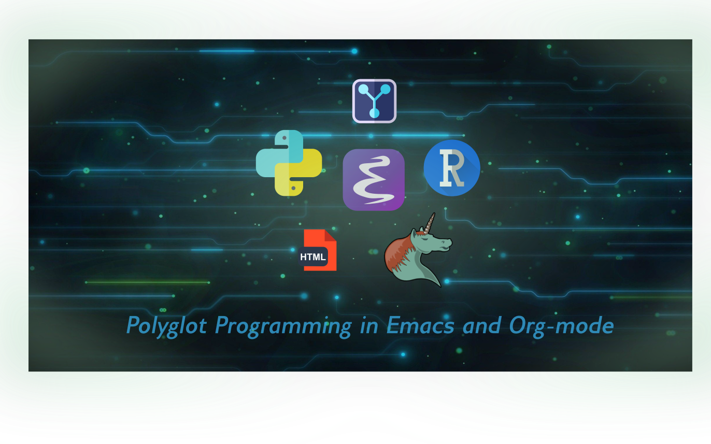

# Polyglot Presentation Workshop

Welcome! The following links will get you where you need to go:

[Project GitHub Repo](https://github.com/allhailthetail/polyglot-workshop)

[Main Presentation](workshop-presentation.html)

[Example Polyglot Notebook - Synthetic Coffee Health Dataset](coffee_analysis.html)

[Coffee Health Report](report.pdf)

Abstract:
> Modern data science increasingly requires the integration of disparate tools, ranging from Python and R for analysis, Bash for system-level automation, and finally typesetting languages for generating final reports. This presentation explores using GNU Emacs and Org-mode as a polyglot notebook to aptly consolidate the research process under one roof.  In addition to the many tips and tricks which aim to streamline the adoption of the tools and methodologies herein, this presentation also contains a practical example of polyglot programming in action, from start to finish. The resulting data and files are readily hosted and properly integrated on a Git platform, properly versioned, openly accessible and freely reproducible from plaintext, whilst also being viewable on nearly any device or platform via ubiquitous HTML and PDF - with minimal additional effort.
